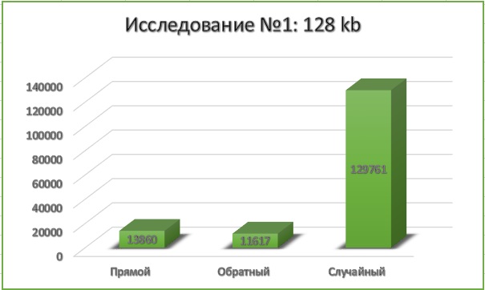
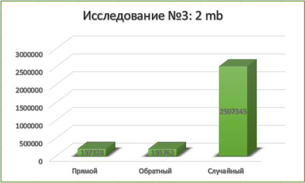
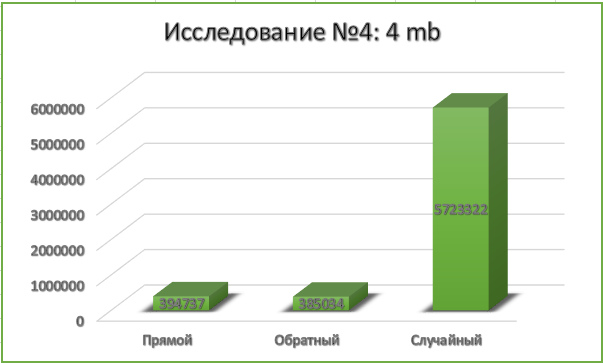
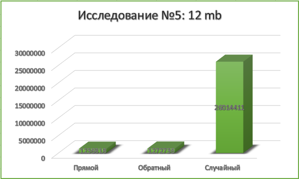

# Лабораторная работа №2

| branch | status |
|--------|--------|
| Testing |[](https://travis-ci.com/github/MIX-1/-lab02-cache-dda)|

##Результаты исследования:

 








В большинстве современных ПК используется следующая иерархия памяти:
| Тип | Скорость доступа | Размер |
| - | - | - |
| Регистры процессора | порядка 1 такта | несколько сотен или тысяч байт |
| Кэш процессора L1 | порядка несколько тактов | десятки килобайт |
| Кэш процессора L2 | от 2 до 10 раз медленнее L1 | от 0.5Mb |
| Кэш процессора L3 | около сотни тактов | от нескольких мегабайт до сотен |
| Кэш процессора L4 (Intel 5 поколения) | несколько сотен тактов | >100Mb |
| ОЗУ | от сотен до тысяч тактов | от нескольких гигабайт до нескольких терабайт |
| Дисковое хранилище | миллионы тактов | до нескольких сотен терабайт |
| Третичная память | до нескольких секунд или минут | практически неограничен |

> Кэш - промежуточный буфер с быстрым доступом, содержащий информацию, которая может быть запрошена с наибольшей вероятностью. Доступ к данным в кэше осуществляется быстрее, чем выборка исходных данных из более медленной памяти или удаленного источника, однако её объём существенно ограничен по сравнению с хранилищем исходных данных.

Информация в кэше хранится в виде групп ячеек памяти (строк), организованных в так называемые **кэш-линии**. Размер кэш-линий может отличаться в разных процессорах, но для большинства x86-процессоров он составляет 64 байта.

Рассмотрим на примере чтение первого элемента массива из оперативной памяти (пусть `sizeof(int)` равен 4 байта):
```cpp
int* arr = new int[32]; // 4 * 32 = 128 байт
int i = arr[0]; // чтение первого элемента (первых четырёх байт) из массива arr
```


При первом чтении данных, которых еще нет в кэш-памяти, происходит серия промахов. В итоге данные были получены из ОЗУ и сохранены на всех уровнях кэша. **Важно** отметить, что размер запрашиваемой памяти составляет 4 байта (первый элемент массива), однако чтение из памяти происходит блоками по 64 байта (размер линии кэша).

Теперь повторное чтение **любых** данных из первых 64 байт массива будет приводить к попаданию в кэш.
```cpp
int j = arr[0]; // чтение с 0 по 3 байт
int k = arr[4]; // чтение с 16 по 19 байт
int m = arr[15]; // чтение с 60 по 63 байт
```


Если же обратиться к любому элементу из второй половины массива (с 16 по 31 элемент), то снова произойдет серия промахов, после чего данные будут успешно кэшированы:
```cpp
int j = arr[16];
```


Теперь массив `arr` полностью находится в кэше `L1`, следовательно любое обращение к элементам массива `arr` будет приводить к попаданию в кэш `L1` и иметь очень высокую скорость чтения.

В случае, если кэш-память заполнена, новые данные вытесняют самые старые.

Далеко не всегда массив может полностью поместиться в кэш-уровене. В качестве примера рассмотрим кэш-уровень `L1` размером `256` байт и два массива `arr1` и `arr2` размером в `256` байт и `320` байт соответственно:
```cpp
int * arr1 = new int[64]; // 4 * 64 = 256 байт
int * arr2 = new int[80]; // 4 * 80 = 320 байт
```

Попробуем обойти массивы в цикле. При чтении одного элемента массива фактически из памяти считывается одна кэш-линия размером в `64` байта. Это означает что в кэш считывается сразу `16` элементов типа `int` (16 * 4 = 64 байта). Поэтому немного оптимизируем наш обход и будем считывать каждый 16-ый элемент массива начиная с нулевого, т.е. элементы с индексами [0, 16, 32, 48, 64...]. При таком способе обхода кадждая попытка чтения будет приводить к загрузке **новой** кэш-линии. Очевидно, что при первом обходе в кэш-памяти нету необходимых данных и будут промахи. Назовем этот проход **прогревом** кэша. Поэтому совершим как минимум два обхода:
```cpp
int k = 0;
int arr1 = new int[64]; // 4 * 64 = 256 байт
for (int i = 0; i < 64; i += 16) // прогрев
    k = arr1[i];
for (int i = 0; i < 64; i += 16) // чтение
    k = arr1[i];
```


При прогреве кэша происходят промахи и приходится производить чтение из следующих уровней памяти. Следовательно, время обращения к элементу массива увеличивается. После прогрева массив `arr1` полностью поместился в кэш-памяти `L1` и время обращения к элементу массива стало равным времени чтения из `L1`.

Однако ситуация меняется для массива `arr2`, который не вмещается в кэш `L1`:
```cpp
int k = 0;
int arr2 = new int[80]; // 4 * 80 = 320 байт
for (int i = 0; i < 80; i += 16) // прогрев
    k = arr2[i];
for (int i = 0; i < 80; i += 16) // чтение
    k = arr2[i];
```


Т.к. массив `arr2` не вмещается в `L1`, то при каждом считывании новой линии кэша происходит промах. Точно такая же логика справедлива для остальных кэш-уровней. Таким образом, обходя массивы различных размеров описанным выше способом, можно измерить время чтения одного элемента массива для каджого кэш-уровня процессора.

### Задача

Используя описанный выше способ обхода провести исследование зависимости времени чтения одного элемента массива от размера массива.

Обход совершить тремя способами:
- **прямой** (0, 16, 32, 48, ...);
- **обратный** (..., 64, 48, 32, 16, 0);
- **случайный** (например 32, 128, 0, 16, 48, 64 и т.д.).

Каждое исследование включает в себя серию эксперементов c определенными размерами.

Количество экспериментов в серии определяется следующим образом:

```cpp
1/2 * cache_sizes['1'] < 2^x < 2^(x+1) < ... < 2^(x+n) < 3/2 * cache_sizes['max']
```

### Пример

В примере ниже показано, что для процессора с тремя уровнями кэша (`2mb`, `4mb`, `8mb`)
необходимо провести серию из 5 эксперементов.

```cpp
cache_size['1'] = 2 mb;
cache_size['2'] = 4 mb;
cache_size['3'] = 8 mb;

// 1mb < 2mb < 4mb < 8mb < 12mb
```

### Эксперимент

Каждый эксперемент состоит из 3 шагов:

```cpp
1. Создание буфера
2. Прогревание кэша
// <-- время начала эксперемнта
3. Циклический проход (1000 итераций)
// <-- время окончание эксперемента
```

#### Шаг 1

Инициализация буфера может происходить, как с помощью чтения данных из файла в выделенную область памяти,
так и с помощью случайного заполнения с использованием генератора случайных чисел.

#### Шаг 2

Данный шаг необходимо выполнить для получения репрезентативных данных, т.к. кэш-память еще не заполнена.

#### Шаг 3

Для получения времени обхода от размера массива процедуру прохода необходимо многократно повторить (порядка 1000 раз).

### Результаты

Ниже представлен формат и пример отчета:

```yaml
investigation:                                       |  investigaion:
  travel_variant: <вариант_прохода>                  |    travel_order: "direction"
  experiments:                                       |    experiments:
  - experiment:                                      |    - experiment:
      number:                                        |        number: 1
      input_data:                                    |        input_data:
        buffer_size: <размер_буфера>                 |          buffer_size: "1mb"
      results:                                       |        results:
        duration: <продолжительность>                |          duration: "1ns"
  - experiment:                                      |    - experiment:
      number: <номер_эксперимента>                   |        number: 2
      input_data:                                    |        input_data:
        buffer_size: <размер_буфера>                 |          buffer_size: "2mb"
      results:                                       |        results:
        duration: <продолжительность>                |          duration: "2ns"
                                                     |
investigation:                                       |  investigation:
...                                                  |  ...
```

⚠️ В отчет также необходимо добавить общий график с результатами всех исследований. ⚠️
